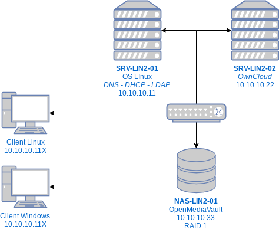

# LIN2

## Introduction

### Objectifs

#### Objectifs principaux

* Implémenter une infrastructure \(DNS, DHCP et LDAP\) complète basée sur des briques libres.
* Installer et configurer un service Cloud ainsi qu’un serveur de stockage sécurisé.

#### Objectifs secondaires

* Être en mesure de prendre en main et de maîtriser les composants LDAP, un DNS gérant une zone directe et une zone inversée, un DHCP gérant la configuration automatique des paramètres réseau des machines cliente.
* Être en mesure de mettre en place un protocole de tests certifiant le bon fonctionnement de chaque étape de la mise en œuvre globale

#### Objectifs opérationnels

* Rédiger une documentation professionnelle dans un français correct et en respectant les conventions typographiques en vigueur.
* Décrire textuellement la mise en place de l’infrastructure
* Construire une recherche et une synthèse des outils informatiques existant pour répondre à des besoins existants
* Être capable de comprendre le fonctionnement de ces outils et d’effectuer leur mise en place et de les tester.

### Méthodologie

* Établir un cahier des charges
* Établir un planning
* Analyser son projet de manière critique
* Être capable de gérer l’impondérable et de réadapter son planning ou de renégocier avec le client certains points du CDC

### **Échéances**

* Semaine COM \(Entre le 25 et le 29 janvier 2020\)

## Présentation de l'infrastructure

La configuration des serveurs est définie statiquement. Les clients obtiennent leur configuration par l'intermédiaire du serveur DHCP. Le serveur DNS doit être configuré pour que les machines clientes puissent utiliser les noms des serveurs.

### SRV-LIN2-01

L’objectif principal de ce module est d’effectuer l’installation et la configuration d’un serveur d’infrastructure \(DNS, DHCP et LDAP\) complet basé sur des briques libres.

* **BIND** \(Berkeley Internet Name Domain\)
* **DHCPD** \(Dynamic Host Configuration Protocol\)
* **OpenLDAP**

Le service DNS \(Domain Name System\) est un service TCP/IP permettant la correspondance entre un nom de domaine qualifié \(FQDN : Fully Qualified Domain Name\) et une adresse IP, par exemple www.cpnv.ch = 128.65.195.16. Ainsi, grâce à DNS, il n'est pas nécessaire de se souvenir des adresses IP.

Un serveur qui héberge le service DNS est appelé “serveur de noms”. la plupart des distributions Linux sont livrées par défaut avec BIND \(Berkley Internet Naming Daemon\), le serveur DNS le plus utilisé sur Internet

Le serveur DHCP de l'Internet Software Consortium, DHCPD, implémente le protocole DHCP \(Dynamic Host Configuration Protocol\), protocole de configuration dynamique des hôtes. DHCP permet à des hôtes appartenant à un réseau TCP/IP de demander et d'obtenir l'affectation d'adresses IP, mais aussi de découvrir les informations relatives au réseau auquel ils sont rattachés..

OpenLDAP est une implémentation libre du protocole LDAP. Le logiciel OpenLDAP ne stocke pas les données directement, il utilise une bibliothèque tierce pour le faire. Généralement, c'est la base de données Berkeley DB qui est utilisée sous Linux.

Le serveur `SRV-LIN2-01` sur lequel seront installés les services DNS, DHCP et LDAP utilisera une distribution Linux de votre choix. \(Attention à justifier votre choix\). Une installation minimale sans interface graphique devra être utilisée pour ce serveur.

L'administration de serveur se fera exclusivement en ligne de commande et à distance, à l'aide d’un serveur SSH utilisant une authentification SSH par clef.

### SRV-LIN2-02

Le second objectif de ce module est de faire découvrir l’installation d’un service Cloud, plus spécifiquement [ownCloud](https://owncloud.org/). L’installation de ownCloud permet de déployer facilement un service cloud permettant, l’hébergement de données, d’agendas, d’images, la synchronisation de ces données entre plusieurs terminaux ainsi que leur partage.

Dans son utilisation basique, l’application permet d'uploader des fichiers via une interface Web ou WebDAV, puis visualiser ces fichiers sous forme d'un bureau en ligne. De nombreuses applications ownCloud viennent se greffer et ajouter des fonctionnalités comme la détection de virus, la journalisation des accès et des changements de fichiers, le versionnage, le chiffrement des fichiers, l’édition de fichiers.

Il est possible d’installer un logiciel client lourd \(disponible pour Linux, Mac OS et Windows\) permettant de synchroniser les fichiers présents sur le disque dur du client avec les fichiers stockés sur le serveur ownCloud. Cette synchronisation peut s’effectuer entre plusieurs postes et plusieurs utilisateurs. L’architecture se base sur des briques libres, pour la partie serveur : PHP, Javascript, Ajax et SQLite ou MySQL ou PostgreSQL comme base de données.

En ce qui concerne la gestion des utilisateurs, l’application s'interfacera avec l’annuaire LDAP du serveur `SRV-LIN2-01`.

Le serveur `SRV-LIN2-02` utilisera une distribution Linux de votre choix. \(Attention à justifier votre choix\). Une installation minimale sans interface graphique devra être utilisée pour ce serveur.

L'administration de serveur se fera exclusivement en ligne de commande et à distance, à l'aide d’un serveur SSH utilisant une authentification SSH par clef.

Le stockage des données des utilisateurs se fera sur le serveur `NAS-LIN2-01`.

#### Authentification SSH par clef

Lorsque l’on souhaite se connecter à un serveur via SSH, l’authentification repose par défaut sur un nom d’utilisateur et un mot de passe. Cependant, les mots de passe sont à la fois très peu sécurisés, difficiles à retenir et pénibles à écrire : ils ne sont efficaces face aux ordinateurs qu’à la condition d’être très contraignants, voire inutilisables, pour les humains.

L’authentification par clef permet de concilier ces deux exigences : elle permet une très forte sécurité et de se connecter simplement. Cette authentification fonctionne grâce à trois composants :

* Une clef publique que l’on fournit préalablement au serveur ;
* Une clef privée, que l’on conserve pour soi et qui permet de prouver son identité au serveur lors de la connexion ;
* Un mot de passe \(facultatif\), qui sera demandé à chaque utilisation de la clef privée.


La connexion aux serveurs **SRV-LIN2-01** et **SRV-LIN2-02** sera basée sur une authentification SSH par clef.


### NAS-LIN2-01

Le troisième objectif de ce module est la mise en production d’un SAN. Le stockage des données utilisateur se fera en utilisant un serveur en **RAID 1** \(logiciel\) à l’aide de la distribution [OpenMediaVault](https://www.openmediavault.org/).

OpenMediaVault est une distribution Linux sous licence libre, basée sur Debian, destinée aux serveurs de stockage en réseau NAS. OpenMediaVault supporte de nombreux protocoles : CIFS \(Samba\), FTP, NFS, rsync, AFP, iSCSI, rapport S.M.A.R.T., l'authentification d'utilisateurs locaux, et RAID Logiciel \(dans de nombreuses variantes\).

OpenMediaVault utilise une interface web pour sa configuration.

### Machines clientes

Pour tester votre infrastructure, **2 machines clientes** seront utilisées. Une machine sous _Linux_ et un autre sous _Windows_. Le logiciel client de ownCloud sera installé sur les deux machines clientes. Les machines ne font pas partie d’un domaine et un utilisateur local nommé `cpnv` avec comme mot de passe `Pa$$w0rd` sera créé localement sur les machines clientes.

## Configuration matérielle des machines virtuelles


**L**e réseau virtuel utilisé dans ce laboratoire \(vswitch dédié HOST ONLY\) ne doit avoir aucune liaison avec le réseau du CPNV.












## Arborescence des données de l'infrastructure \(Utilisateurs et quotas\)


La gestion des groupes, des utilisateurs et des droits d’accès sur les partages se fait en utilisant l’annuaire **LDAP** installé sur le serveur `SRV-LIN2-01`.


## Evaluation

### Evaluation et pondération

1. Documentation de mise en service et d’analyse à réaliser sur _GitBook_  [https://app.gitbook.com/](https://app.gitbook.com/) \(**20%**\)
2. Document de mise en service : script d’installation \(lignes de commande\) et de configuration des serveurs \(modification des fichiers de configuration\) \(**20%**\)
3. Archive contenant les `OVA` des 3 serveurs configurés et peuplés. \(**10%**\)
4. POC \(Proof Of Concept\) \(**50%**\)



Votre document sera évalué selon les critères suivants :

* `Solution fonctionnelle et techniquement correcte`
* `Justification des choix`
* `Reproductibilité`
* `Facilité d’implémentation et d’évolution`
* `Respect des normes en vigueur (technique et sécurité)`
* `Respect de l'énoncé et des spécifications de départ`
* `Clarté des explications, lisibilité`
* `Utilisation de terminologie technique`
* `Sources`

