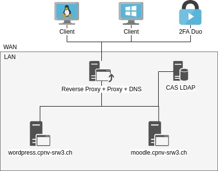

# SRW3

## CAS Enterprise Single Sign-On et Reverse Proxy


CAS, ou Central Authentication Service, est un protocole Open Source à authentification unique pour le Web. CAS donne aux utilisateurs l'accès à plusieurs applications à l'aide d'une seule connexion et permet aux applications Web d'authentifier les utilisateurs sans leur donner accès à leurs mots de passe. CAS comporte un composant serveur Java et diverses bibliothèques client écrites en PHP , PL/ SQL , Java , etc.

Dans ce module, nous aborderons l'architecture et les fonctionnalités de CAS, ainsi que la pratique de l'installation et de la configuration d'un serveur CAS. À la fin du module, les étudiants comprendront la mise en œuvre par SSO de l'authentification unique \(Single-Sign-On Authentication\) ainsi que la pratique nécessaire pour déployer et gérer leur propre serveur d'authentification à travers un reverse proxy.

**Objectif principal**

* Implémenter un  serveur CAS Enterprise Single Sign-On  se basant sur un annuaire local LDAP
* Installer et configurer un reverse-proxy \(en français le terme de relais inverse est parfois employé\)

**Objectifs secondaires**

* Sélectionner les éléments à engager en fonction des besoins réels, à savoir, au minimum le  CAS Enterprise Single Sign-On.
* Être en mesure de prendre en main et de maîtriser les composants Active Directory nécessaires, un DNS gérant une zone directe et une zone inversée, les outils relatifs aux stratégies et à leur engagement et gestion.
* Être en mesure de mettre en place un protocole de tests certifiant le bon fonctionnement de chaque étape de la mise en œuvre globale.

**Objectifs opérationnels**

* Rédiger une documentation professionnelle dans un français correct et en respectant les conventions typographiques en vigueur.
* Décrire textuellement la mise en place de l’infrastructure
* Construire une recherche et une synthèse des outils informatiques existant pour répondre à des besoins existants
* Être capable de comprendre le fonctionnement de ces outils et d’effectuer leur mise en place et de les tester.

**Méthodologie**

* Établir un cahier des charges
* Établir un planning
* Analyser son projet de manière critique
* Être capable de gérer l’impondérable et de réadapter son planning ou de renégocier avec le client certains points du CDC

**Échéances**

* Semaine COM
  * `nom.prenom.SRW3.pdf` \(40% de la note finale\)  6 pages Max.
  * Proof Of Concept \(60% de la note finale\)

#### Introduction

Dans ce module vous allez installer un serveur CAS Enterprise Single Sign-On utilisant un annuaire LDAP. Pour plus de sécurité, une double authentification sera mise en place. Un serveur reverse proxy sera utilisé pour la gestion du protocole https et pour rediriger les requêtes sur le bon serveur présent dans le LAN. L'authentification des serveurs SSL ainsi que l’échange d'information entre les serveurs \(WEB,CAS,LDAP…\) doit être sécurisé et utiliser des certificats x509. Toute l'infrastructure sera réalisée sous Linux.




Seule la machine Reverse Proxy une interface accessible depuis le WAN.


#### Serveur PROXY


[http://www.squid-cache.org/](http://www.squid-cache.org/)  
[https://fr.wikipedia.org/wiki/Squid\_\(logiciel\)](https://fr.wikipedia.org/wiki/Squid_%28logiciel%29)

Le serveur **mandataire** \(proxy\) est une machine souvent physiquement située entre un réseau et son accès à Internet. Il fait office à la fois de passerelle pour l'accès à Internet et de cache de pages web.

* Passerelle, parce que tous les accès à Internet passent par le Proxy,
* Cache, parce que le Proxy conserve en mémoire cache \(sur disque\), une copie des pages consultées par les utilisateurs du réseau. Cela évite de télécharger à nouveau la même page sur le site d'origine,si un utilisateur revient fréquemment dessus.

Il nous permettra ainsi de gérer l'accès à internet aux utilisateurs de notre réseau local en fonction des heures d'accès, des ports de destination d'un service, d'IP sources, etc.

Comme serveur proxy, nous allons utiliser le **serveur Squid** qui est un logiciel libre distribué selon les termes de la licence GNU GPL.

Un **serveur Squid** est un **serveur** mandataire \(**proxy**\) et un mandataire inverse conçu pour relayer les protocoles FTP, HTTP, Gopher, et HTTPS. Contrairement aux **serveurs proxy** classiques, un **serveur Squid** gère toutes les requêtes en un seul processus d'entrée/sortie asynchrone.


#### Serveur LDAP


[https://fr.wikipedia.org/wiki/Lightweight\_Directory\_Access\_Protocol](https://fr.wikipedia.org/wiki/Lightweight_Directory_Access_Protocol)  
[https://www.openldap.org/](https://www.openldap.org/)

L'informatique et la gestion de l'information prennent une place de plus en plus importante dans notre société, particulièrement en entreprises. La multiplication des applications et des serveurs rend cette information difficile à maîtriser, car très volatile et éparse. Ceci entraîne bien souvent une obsolescence, voire une incohérence des données stockées. Les annuaires LDAP offrent une réponse à ce problème en proposant de centraliser les informations et, par le biais d'un protocole standardisé, d'y connecter des applications clientes.

LDAP signifie Lightweight Directory Access Protocol. C’est le standard de fait pour accéder à un annuaire. Un annuaire est une base de données qui va contenir des informations sur des personnes, des machines, des groupes ou toute autre catégorie que vous pourriez imaginer.

```text
Adresse ldap.cpnv-srw3.ch
Domaine de base dc=cpnv-srw3,dc=ch
Utilisateur dc=People,dc=cpnv-srw3,dc=ch
Protocole LDAPS
```

L’annuaire contient 2 utilisateurs

```text
user01 password : Mot2Pa$$301
user02 password : Mot2Pa$$302
```

#### Serveur CAS


[https://fr.wikipedia.org/wiki/Central\_Authentication\_Service](https://fr.wikipedia.org/wiki/Central_Authentication_Service)  
[https://www.esup-portail.org/consortium/espace/SSO\_1B/cas/jres/cas-jres2003-article.pdf](https://www.esup-portail.org/consortium/espace/SSO_1B/cas/jres/cas-jres2003-article.pdf)  
[https://apereo.github.io/cas/5.2.x/index.html](https://apereo.github.io/cas/5.2.x/index.html)

CAS est un système d'authentification unique : on s'authentifie sur un site Web, et on est alors authentifié sur tous les sites Web qui utilisent le même serveur CAS. Il évite de s'authentifier à chaque fois qu'on accède à une application en mettant en place un système de tickets.

CAS est essentiellement un protocole basé sur des requêtes HTTP pures. Ce protocole est basé sur une notion d'échange de tickets, un peu à la manière de Kerberos. Ces tickets ne transportent aucune information.

#### Serveur reverse proxy

[https://fr.wikipedia.org/wiki/Proxy\_inverse](https://fr.wikipedia.org/wiki/Proxy_inverse)  
[https://nginx.org/en/docs/http/configuring\_https\_servers.html](https://nginx.org/en/docs/http/configuring_https_servers.html)  
[https://docs.nginx.com/nginx/admin-guide/web-server/reverse-proxy/](https://docs.nginx.com/nginx/admin-guide/web-server/reverse-proxy/)

On parle de reverse-proxy pour désigner une application placée en frontal \(directement en contact avec les clients\) et qui joue le rôle d’un intermédiaire avec des applications placées en backend \(sans contact direct avec les clients\). Contrairement au serveur proxy qui permet à un utilisateur d'accéder au réseau Internet, le proxy inverse permet à un utilisateur d'Internet d'accéder à des serveurs internes.


Ce serveur possède la seule adresse IP visible depuis le WAN. Il s'appuie sur un serveur DNS local pour la gestion des entête d’hôte afin de rediriger les requêtes sur le bon serveur en aval.

```text
wordpress.cpnv-srw3.ch → Serveur WordPress
moodle.cpnv-srw3.ch → Serveur Moodle
```

#### Serveur WordPress

[https://fr.wordpress.com/](https://fr.wordpress.com/)  
[http://weblog.plexobject.com/?p=1682](http://weblog.plexobject.com/?p=1682)


WordPress est un système de gestion de contenu gratuit, libre et open-source. Ce logiciel écrit en PHP repose sur une base de données MySQL et est distribué par la fondation WordPress.org.

* `wordpress.cpnv-srw3.ch`
* Configuration de la connexion unique \(SSO\) pour WordPress
* Les utilisateurs `user01` et `user02` ont un compte validé sur ce serveur

#### Serveur Moodle

​[https://moodle.org/plugins/auth\_casattras](https://moodle.org/plugins/auth_casattras)


Moodle est une plateforme d'apprentissage en ligne libre distribuée sous la Licence publique générale GNU écrite en PHP. Développée à partir de principes pédagogiques, elle permet de créer des communautés s'instruisant autour de contenus et d'activités.

* `moodle.cpnv-srw3.ch`
* Configuration de la connexion unique \(SSO\) pour WordPress, ceci pour chacun des deux utilisateurs
* Seul l’utilisateur `user01` à un compte validé sur ce serveur \(ex. Autoriser seulement les utilisateurs qui font partie du groupe LDAP moodle\)

#### Double authentification \[BONUS\]


[https://fr.wikipedia.org/wiki/Double\_authentification](https://fr.wikipedia.org/wiki/Double_authentification)  
[https://apereo.github.io/cas/6.1.x/mfa/DuoSecurity-Authentication.html](https://apereo.github.io/cas/6.1.x/mfa/DuoSecurity-Authentication.html)

La double authentification est une méthode d'authentification forte par laquelle un utilisateur peut accéder à une ressource informatique après avoir présenté deux preuves d'identité distinctes à un mécanisme d'authentification.

* Mettez en place une double authentification se basant sur la solution “Duo Security Authentication”

#### Proof Of Concept

Configurez un client de votre choix pour que toutes les requêtes en direction du domaine cpnv-srw3.ch soient redirigé vers le serveur Reverse Proxy

* [ ] [https://wordpress.cpnv-srw3.ch](https://wordpress..cpnv-srw3.ch) → redirection serveur wordpress en https
* [ ] [https://wordpress.cpnv-srw3.ch ](https://wordpress.cpnv-srw3.ch)\(Authentification `User01`\)
* [ ] [https://wordpress.cpnv-srw3.ch](https://wordpress.cpnv-srw3.ch) \(Authentification `User02`\)
* [ ] Changer mot de passe User01 \(password : `Mot2Pa$$301_new`\)
* [ ] [https://moodle.cpnv-srw3.ch](https://moodle.cpnv-srw3.ch) → redirection serveur Moodle en https
* [ ] [https://moodle.cpnv-srw3.ch](https://moodle.cpnv-srw3.ch) \(Authentification `User01`\) → Nouveau mot de passe
* [ ] [https://moodle.cpnv-srw3.ch](https://moodle.cpnv-srw3.ch) \(Authentification `User02`\) → Pas validé
* [ ] Création d’un utilisateur `User03` \(password : `Mot2Pa$$303`\)
* [ ] Valider l'accès de `User03` aux deux serveurs
* [ ] [https://wordpress](https://wordpress.cpnv-srw3.ch)[.cpnv-srw3.ch](https://wordpress.cpnv-srw3.ch) \(Authentification `User03`\)
* [ ] [https://moodle.cpnv-srw3.ch](https://moodle.cpnv-srw3.ch) \(Authentification `User03`\)


**Une grille de correction avec une pondération détaillée vous sera fournie avant la semaine COM**


